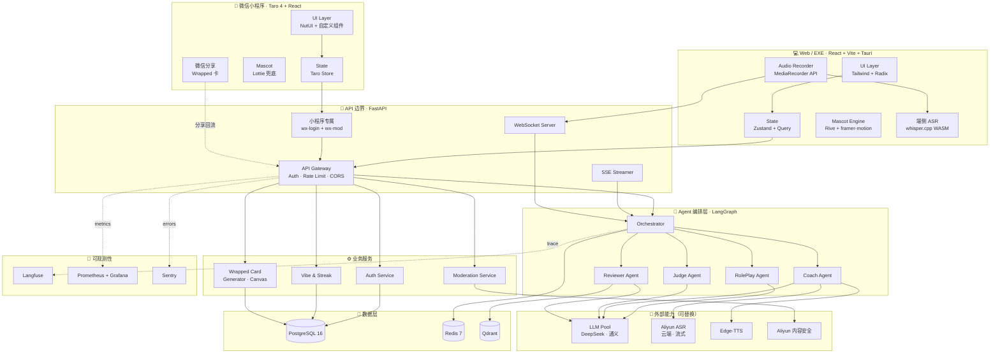

# CareerCoach AI — 项目地基 Foundation v1.0

> **这份文档的特殊用途**：作为 AI 助手（Claude / Cursor / Copilot）加载到上下文的**项目锚点**。
> 团队任何一次新对话开始前，把 §5 内容粘贴给 AI，让 ta 在你的项目里"知道自己在哪"。
>
> **三件事**：① 锁边界 ② 锁 NFR ③ 锁技术栈 + 草图架构。
> **核心原则**：能验证就不靠承诺、能轻就不重、能演进就不一次到位。
>
> 关联：[PRD v2.3](./careercoach-prd-v2.md) · [设计图纸 v2](./careercoach-design-spec.md)
> 状态：Locked for Sprint 0

---

## 0. 文档导航

1. [项目边界 Boundaries](#1-项目边界-boundaries)
2. [非功能需求 NFRs](#2-非功能需求-nfrs)
3. [技术栈锁定](#3-技术栈锁定)
4. [轻量架构草案](#4-轻量架构草案)
5. [AI 全局上下文（可粘贴版）](#5-ai-全局上下文)
6. [Sprint 0 验证 Spike 清单](#6-sprint-0-验证-spike-清单)
7. [附录](#7-附录)

---

## 1. 项目边界 Boundaries

> **作用**：避免范围蔓延（scope creep）。任何想加进来的功能/技术/场景必须先回答"它在边界内吗"。

### 1.1 我们是什么 / 不是什么

| 是 | 不是 |
|----|------|
| ✅ 中文语境的**对话练习教练** | ❌ 通用聊天 AI / 心理咨询师 / 律师 |
| ✅ 面向**在校大学生 + 实习生**的工具 | ❌ 面向 30+ 资深职场人 / 企业 B 端 |
| ✅ **多 Agent 编排**的轻应用 | ❌ 端到端训练自有大模型 |
| ✅ **三端**：Web 浏览器 + EXE 桌面（Tauri）+ 微信小程序 | ❌ 原生 iOS / Android（v1 不做，v2 用 Tauri Mobile）|
| ✅ 鼓励**真话 + 边界感** | ❌ 教唆撕逼 / 反派话术 |

### 1.2 用户边界

| 服务 | 不服务 |
|------|--------|
| 18-25 岁青年（小苏 / 小林 / 小陈）| 中小学生（< 18 默认青少年模式 / 部分功能禁用）|
| 普通话用户 | 粤语 / 客家话 / 英语（v2）|
| 中国大陆用户 | 海外用户（v2+）|

### 1.3 功能边界（In / Out）

详见 [PRD §1.5 Out of Scope](./careercoach-prd-v2.md#15-out-of-scope-明确不做)。**关键 5 条**：

- ❌ 计费 / 付费墙 / 会员
- ❌ AI 视频对练（数字人）
- ❌ 群聊场景（非 1 对 1）
- ❌ 自研 LLM / ASR / TTS
- ❌ 替代心理咨询的内容

### 1.4 法律与合规边界

| 红线 | 落地措施 |
|------|---------|
| 内容安全（涉政 / 自残 / 暴力 / 网贷）| 阿里云审核 + 200 对抗样本 + 200 自建词典 |
| 未成年保护 | 注册年龄验证 + 青少年模式 + 30 天数据保留 |
| 个人信息（《个保法》）| 端侧 ASR / 24h 录音删除 / 用户主动删除 |
| 不替代专业服务 | 法律 / 心理 / 医疗触发即引导专业资源 |

### 1.5 时间与资源边界

| 维度 | 上限 |
|------|------|
| 总工期 | 4 周（W1-W4）+ 1 周答辩准备 |
| 团队 | 全栈 ×2 + 产品/设计 ×1 |
| 预算 | LLM/ASR API 月度 ≤ ¥2000 / ECS ≤ ¥500 / 月 |
| 数据 | 30 真实用户测试 + 200 对抗样本 + 1000 RAG 文档 |

---

## 2. 非功能需求 NFRs

> **写法约定**：每条 NFR 必须有【量化指标 + 测量方式 + 通过门槛】。无量化的 NFR 视为废话。

### 2.1 性能 SLO（Service Level Objective）

| # | 指标 | 目标 | 测量 | 兜底 |
|---|------|------|------|------|
| P-01 | 沙盘首字延迟 | P50 ≤ 1.0s · P95 ≤ 1.5s | Langfuse trace | 主备 LLM 切换 ≤ 800ms |
| P-02 | 流式速率 | ≥ 30 token/s | 客户端打点 | 模型降级到通义 |
| P-03 | 副驾端到端延迟 | P50 ≤ 1.0s · P95 ≤ 1.5s | 客户端 to 客户端打点 | 端侧 ASR + 提示降级 |
| P-04 | ASR 准确率（普通话）| ≥ 92%（云端）/ ≥ 85%（端侧）| 200 句标准测试集 | 标记降级模式 |
| P-05 | 复盘 5000 字处理 | ≤ 30s | 后端日志 | 异步 + 通知 |
| P-06 | Wrapped 卡生成 | ≤ 5s | 客户端打点 | 静态截图兜底 |
| P-07 | 场景库首屏 | ≤ 800ms | Lighthouse | CDN 缓存 |
| P-08 | API P95 响应 | ≤ 500ms（非 LLM 接口）| Prometheus | 限流 + 降级 |

### 2.2 可用性

| # | 指标 | 目标 |
|---|------|------|
| A-01 | 答辩日核心链路 | 99.99%（连续 5 小时）|
| A-02 | 平时核心链路 | 99.5% |
| A-03 | LLM 主备切换时间 | ≤ 800ms |
| A-04 | 单节点重启 RTO | ≤ 60s |
| A-05 | 数据库 RPO | ≤ 24h（每日备份）|

### 2.3 安全与合规

| # | 项 | 要求 |
|---|----|------|
| S-01 | 全链路 HTTPS / WSS | TLS 1.3 |
| S-02 | 内容审核 | 红线类目召回率 ≥ 99.5%（200 对抗样本测试）|
| S-03 | 用户密码 | 仅短信验证码（不存密码）|
| S-04 | API 限流 | 见 [PRD §7.12](./careercoach-prd-v2.md#712-速率限制) |
| S-05 | 日志脱敏 | 人名 / 手机号 / 邮箱不进日志 |
| S-06 | 录音原文 | 24h 删除 / 青少年模式不存 |
| S-07 | 备份加密 | AES-256 |

### 2.4 可观测性 SLI

| # | 项 | 工具 |
|---|----|------|
| O-01 | LLM 链路追踪 | Langfuse（每条 prompt → response 全流程）|
| O-02 | 基础设施指标 | Prometheus + Grafana（CPU/RAM/请求数/错误率）|
| O-03 | 异常告警 | Sentry（前后端错误聚合）|
| O-04 | 用户行为埋点 | 自建简单埋点 → ClickHouse（v2）/ 简化版 PostgreSQL（v1）|
| O-05 | 红线监控仪表盘 | 见 [PRD §11.3](./careercoach-prd-v2.md#113-红线监控仪表盘必须有) |

### 2.5 成本约束（v1 月度）

| 项 | 上限 | 说明 |
|----|------|------|
| LLM API（DeepSeek + 通义）| ¥1500 | 单次沙盘 ≤ 30K token |
| ASR（阿里云）| ¥300 | 优先用免费额度 |
| ECS | ¥500 | 单台 4C8G |
| 域名 / 证书 | ¥100 | aliyun 域名 + Let's Encrypt |
| 短信 | ¥100 | 演示阶段 ≤ 1000 条 |
| **总计** | **¥2500/月** | 答辩前两个月 ≤ ¥5000 |

### 2.6 可维护性

| # | 项 | 要求 |
|---|----|------|
| M-01 | 代码规范 | ESLint + Prettier + Ruff（强制 CI 通过）|
| M-02 | 类型覆盖 | TypeScript strict / Python type hints 100% |
| M-03 | 测试覆盖 | 核心模块单测 ≥ 60% |
| M-04 | 文档同步 | PRD / 设计 / 代码三处变更，2 处必须同步 |
| M-05 | PR 大小 | 单 PR ≤ 800 行（避免大 PR）|

### 2.7 可扩展性

| # | 项 | 要求 |
|---|----|------|
| E-01 | LLM 提供方可换 | 抽象 `LLMProvider` 接口，新增模型 ≤ 1 天集成 |
| E-02 | 场景库可热更 | 数据库存储 + 后台 CMS（v2）/ 直接 SQL 改（v1）|
| E-03 | Agent 可加可减 | LangGraph 节点级可插拔 |
| E-04 | 多端共用 API | 同一组 API 服务手机/平板/桌面 |
| E-05 | 国际化预留 | 文案库走 i18n key（v1 仅 zh-CN，但格式留好）|

---

## 3. 技术栈锁定

> **写法约定**：每个组件 = 选型 + 版本 + Why + Verify + Alt + Switch Cost。**没有 Verify 的选型不许进 Sprint 0**。

### 3.1 全栈一览

| 层 | 选型 | 版本 |
|----|------|------|
| 前端框架 | React + TypeScript + Vite | 19 / 5.5 / 6.0 |
| 桌面跨端 | **Web 版** + **EXE 版（Tauri 2）** 共享 React 代码 | Tauri 2.0 |
| 移动端 | **微信小程序（Taro 4 + React）** 独立代码库 | Taro 4.0 |
| UI 库（Web/EXE）| Tailwind CSS + Radix UI 原语 | 4.0 / 1.x |
| UI 库（小程序）| Taro UI / NutUI 4 | latest |
| 动效 | framer-motion + Rive（Mascot）| 11.x / 0.7 |
| 状态 | Zustand + TanStack Query | 5.x / 5.x |
| 后端框架 | FastAPI + Uvicorn | 0.115 / 0.32 |
| 语言 | Python | 3.12 |
| 包管理 | **pnpm** + **uv** | 9.x / 0.4 |
| Agent 编排 | LangGraph + LangChain | 0.2 / 0.3 |
| LLM 主 | DeepSeek-V3 | API |
| LLM 备 | 通义千问 Qwen-Max | API |
| ASR 主 | 阿里云实时 ASR | SDK |
| ASR 端侧 | whisper.cpp（whisper-tiny-zh）| 1.6 |
| TTS | Microsoft Edge-TTS | 6.x |
| 数据库 | PostgreSQL | 16 |
| 缓存 | Redis | 7 |
| 向量库 | Qdrant | 1.10 |
| 内容审核 | 阿里云内容安全 + 自建词典 | API |
| 可观测 | Langfuse + Prometheus + Sentry | 自部署 / 2.x / 8.x |
| 部署 | Docker Compose（dev）→ ECS | 25.x |
| CI/CD | GitHub Actions | — |
| 测试 | Vitest + pytest + Playwright | 2.x / 8.x / 1.48 |

### 3.2 前端栈

#### 3.2.1 React 19 + TypeScript 5.5 + Vite 6
- **Why**：标准、生态成熟、HMR 飞快
- **Verify**：`pnpm create vite@latest` 起项目，第一屏 < 1s 渲染
- **Alt**：SvelteKit（学习曲线）/ Solid（生态小）
- **Switch Cost**：高（生态绑定深）

#### 3.2.2 三端策略（v1 锁定）

> **核心架构思路**：1 份后端 API + 2 份前端代码库（Web/EXE 共享 + 小程序独立）

##### 端 1 · Web 浏览器版
- **技术**：React 19 + Vite 6 + Tailwind 4 + Radix UI
- **用户**：在校 / 工位 / 平板浏览器场景
- **能力**：全功能（含副驾）
- **Verify**：Chrome / Edge / Safari 三浏览器沙盘通跑

##### 端 2 · EXE 桌面应用
- **技术**：Tauri 2.0 套同一份 Web 代码（不另写）
- **用户**：学生工位常驻、安装版用户
- **能力**：全功能（含副驾，比 Web 体验更好——可后台运行）
- **Verify**：`pnpm tauri build` 生成 < 10MB 安装包，Win10/Win11 双测
- **优势 vs Web**：本地文件读写 / 全局快捷键 / 系统托盘 / 后台麦克风
- **Alt**：Electron（包大 30MB+ ❌）/ Wails（Go，团队不熟 ❌）

##### 端 3 · 微信小程序
- **技术**：Taro 4 + React + NutUI 4
- **用户**：移动端主战场（学生最常用的设备）
- **能力**：沙盘 / 复盘 / Wrapped 分享 / 弱点画像 / 通知（**不含副驾**）
- **Verify**：D5 跑通"沙盘对练 + 一键 Wrapped 分享到群"完整链路
- **Why Taro**：团队熟 React，一份代码可同时编译小程序 + H5 + RN
- **Alt**：uni-app（Vue）/ 原生小程序（开发慢）/ 跳过小程序（错过传播渠道）

##### 三端能力矩阵（v1）

| 能力 | Web | EXE | 小程序 |
|------|:---:|:---:|:---:|
| 沙盘对练（文字 + 语音）| ✅ | ✅ | ✅（仅文字 v1）|
| 实战副驾 | ✅ | ✅✅ 核心 | ❌（v1 砍掉）|
| 复盘师（图/音/文）| ✅ | ✅ | ✅（仅图/文 v1）|
| 弱点画像 | ✅ | ✅ | ✅ |
| Wrapped 卡生成 | ✅ | ✅ | ✅✅ 核心 |
| 跨端会话同步 | ✅ | ✅ | ✅ |
| 教练 K Mascot | ✅ Rive | ✅ Rive | ⚠️ Lottie 兜底 |

**关键设计原则**：小程序不是 Web 的"阉割版"，而是**社交传播主入口**；Web/EXE 是**深度使用主入口**。

##### 微信小程序专属约束（必须设计时注意）

| 约束 | 应对 |
|------|------|
| 主包 ≤ 2MB | 把 Mascot Rive 文件 + 字体放分包 |
| 总包 ≤ 20MB | Wrapped 卡的渐变背景走云端渲染 |
| 域名必须备案 + 白名单 | 答辩前 1 月备案 + 配置 wxapp 后台 |
| 录音受限（无法长时间后台监听）| 副驾不做小程序版 |
| 不能用 IndexedDB | 用 wx.setStorage（5MB 上限）|
| 不能跑 WebAssembly（whisper.cpp）| ASR 全走云端 |
| 必须遵守内容审核 | 文本提交前调微信内容安全 API |
| 平台审核可能拦截 | 提交前自查"AI 教练"类目可能被归"职业培训" |

#### 3.2.3 Tailwind 4 + Radix UI
- **Why**：Tailwind 出图快 + 设计 token 直接映射；Radix 提供无样式行为
- **Verify**：把 [设计图纸 §3](./careercoach-design-spec.md#3-设计-token) 的 token 翻译成 `tailwind.config.ts` 一周内完成
- **Alt**：shadcn/ui（基于 Radix，可直接拷贝）/ Mantine

#### 3.2.4 framer-motion + Rive
- **Why**：弹簧动效 / Mascot 动画都需要——Rive 比 Lottie 文件小且可交互
- **Verify**：教练 K 弹簧入场 + 8 表情切换在 5 设备测试 60 fps
- **Alt**：Lottie（文件大、不可交互）/ CSS animation（无 spring）

#### 3.2.5 Zustand + TanStack Query
- **Why**：Zustand 写法极简（vs Redux）；TanStack Query 处理服务端状态
- **Verify**：第一个登录状态用 Zustand 写，10 行内搞定
- **Alt**：Jotai / Redux Toolkit（重）

### 3.3 后端 + Agent 栈

#### 3.3.1 FastAPI 0.115 + Python 3.12 + Uvicorn
- **Why**：原生 async + SSE 友好 + 类型友好 + Pydantic 数据校验
- **Verify**：`/health` 返回 200 + 一个 SSE 端点流式返回 30 token/s（Sprint 0 D1）
- **Alt**：Hono/Node.js（不熟）/ Go Gin（团队不会）

#### 3.3.2 uv（包管理）
- **Why**：比 pip / poetry 快 10-100 倍，pyproject.toml 标准
- **Verify**：`uv sync` 在新机器 < 30s 完成
- **Alt**：poetry（慢）/ pip（无 lockfile）

#### 3.3.3 LangGraph 0.2 + LangChain 0.3
- **Why**：DAG 编排 + 状态机 + 内置 trace（perfect for 多 Agent）
- **Verify**：构建一个 3 节点图（RolePlay → Coach → Judge），节点间状态可观察（Sprint 0 D2）
- **Alt**：LlamaIndex（偏检索）/ CrewAI（更新但生态小）/ 自研（浪费时间）
- **关键风险**：版本变化快，锁定 0.2.x 不升

#### 3.3.4 模型路由抽象层（自写）
- **Why**：必须能 1 行代码切换 DeepSeek / 通义 / 文心
- **Verify**：写 `LLMProvider` 抽象 + 3 个 adapter，单元测试覆盖三家
- **Alt**：直接 import openai client（耦合死）

```python
# 关键抽象 · 必须实现
class LLMProvider(Protocol):
    async def stream_chat(
        self,
        messages: list[Message],
        temperature: float = 0.7,
        timeout: float = 8.0,
    ) -> AsyncIterator[str]: ...
```

### 3.4 LLM / ASR / TTS

#### 3.4.1 DeepSeek-V3（主）+ 通义 Qwen-Max（备）
- **Why DeepSeek**：中文谈判语料强、价格 1/10 GPT-4、API 兼容 OpenAI
- **Why 通义备**：阿里生态可申请教育优惠、稳定性好
- **Verify**：30 个对练场景 × 两家模型 → 人工评分 ≥ 4/5 才上线
- **预期成本**：单次沙盘对练（30 轮 × 200 token IO）≈ ¥0.05
- **Alt**：GPT-4（贵 + CN 慢）/ Claude（CN 访问难）/ 文心（不稳定）

#### 3.4.2 阿里云实时 ASR（主）
- **Why**：中文准确率 ≥ 95%、流式 SDK 完善、教育优惠
- **Verify**：100 句标准测试集准确率 ≥ 92%（嘈杂环境 ≥ 85%）
- **Alt**：腾讯云 ASR（相当）/ Whisper API（贵 + 慢）

#### 3.4.3 whisper.cpp（端侧降级）
- **Why**：开源、tiny 模型 75MB 可塞进 PWA、离线可用
- **Verify**：红米 Note + 荣耀 Play 真机延迟 ≤ 800ms
- **Alt**：transformers.js（更慢）

#### 3.4.4 Edge-TTS（副驾耳机提示）
- **Why**：免费、中文女声"晓晓"很自然、低延迟
- **Verify**：单条 25 字提示生成 ≤ 300ms
- **Alt**：字节 TTS（付费）/ Aliyun TTS（付费）

### 3.5 数据存储

#### 3.5.1 PostgreSQL 16
- **Why**：JSONB 友好（Session.context）、可选 pgvector（备用 RAG）、稳定
- **Verify**：Docker 起来 + 跑迁移脚本（alembic）+ 第一条 INSERT
- **Alt**：MySQL（JSONB 弱）/ SQLite（多用户不支持）

#### 3.5.2 Redis 7
- **Why**：实时上下文缓存 + Rate limit + Session
- **Verify**：连接 + Hello World
- **Alt**：Memcached（功能少）/ 内存字典（不持久）

#### 3.5.3 Qdrant 1.10
- **Why**：轻量、Docker 一键起、性能好、免费自托管
- **Verify**：插入 1000 条 RAG 文档，查询 P95 ≤ 50ms
- **Alt**：Chroma（更轻但功能少）/ pgvector（如果想合并）/ Pinecone（付费）

### 3.6 内容安全

#### 3.6.1 阿里云内容安全 API
- **Why**：覆盖涉政 / 暴力 / 涉黄 / 谣言全类目，适合中国合规
- **Verify**：跑 200 对抗样本，红线召回 ≥ 99.5% / 误杀 ≤ 3%
- **Alt**：腾讯云内容安全（相当）

#### 3.6.2 自建敏感词词典 + 规则引擎
- **Why**：补充阿里云没覆盖的【校园贷 / 网贷 / 校园暴力 / 自残】场景
- **Verify**：词典 ≥ 200 词，规则覆盖 §3.0.5 五大类
- **Alt**：用 LLM 自审（慢 + 不稳定）

### 3.7 可观测性

#### 3.7.1 Langfuse（LLM trace · 自部署）
- **Why**：每条 prompt → response 全可追溯，支持 LangGraph 自动埋点
- **Verify**：第一次沙盘对练在 dashboard 可见
- **Alt**：LangSmith（付费）/ 自打日志（看不到关系）

#### 3.7.2 Prometheus + Grafana（基础设施）
- **Why**：业界标准，免费
- **Verify**：第一个 dashboard 看到 CPU / RAM / API 请求数
- **Alt**：自建（重复造轮子）

#### 3.7.3 Sentry（错误聚合）
- **Why**：前后端统一收集错误，免费 5K event/月
- **Verify**：故意抛错 → Sentry 5s 内收到
- **Alt**：自建错误日志（找问题难）

### 3.8 部署 / CI

#### 3.8.1 Docker + Docker Compose（开发）→ 阿里云 ECS（生产）
- **Why**：单台 ECS 跑全部服务（FastAPI + Postgres + Redis + Qdrant + Langfuse），简单
- **Verify**：`docker compose up` 一键起完整栈，从 0 到能用 ≤ 5 分钟
- **Alt**：K8s（4 周团队不需要）/ Vercel + Supabase（绑定深）
- **演进**：v2 用户量超 1000 DAU 再考虑拆服务

#### 3.8.2 GitHub Actions（CI）
- **Why**：免费、生态、和 GitHub 一体
- **Verify**：第一个 PR 触发 lint + test + build 全过
- **Alt**：GitLab CI（团队没用）

#### 3.8.3 阿里云 ECS（4C8G ≈ ¥300/月）
- **Why**：价格稳、备案方便、和 ASR/审核同生态
- **Verify**：购买 + 域名解析 + HTTPS 证书 ≤ 半天
- **Alt**：腾讯云（相当）/ 自购物理机（不稳）

### 3.9 测试

| 层 | 工具 | 覆盖率目标 |
|----|------|------|
| 前端单测 | Vitest + Testing Library | 60% 核心组件 |
| 后端单测 | pytest + httpx | 70% 业务逻辑 |
| API 集成 | pytest + Docker Compose | 100% 公开接口 |
| E2E | Playwright | 5 个核心流程 |
| LLM 回归 | 自建 LLM-judge 框架 | 30 场景 / 周 |
| 红线对抗 | 200 对抗样本（每月跑）| 100% 拦截 |

---

## 4. 轻量架构草案

### 4.1 架构哲学

| 原则 | 含义 | 反例 |
|------|------|------|
| **KISS** | 单台 ECS 跑全部服务 | k8s + 多服务网格 |
| **可演进** | 抽象 LLMProvider / ASRProvider | 直接调具体厂商 |
| **可观察** | 每个 LLM call 进 Langfuse | 黑盒发出去 |
| **可降级** | 主备 + 端侧 + 静态兜底 | 单点依赖 |
| **不预测未来** | v1 不为 v2 预留过多 | 提前设计百万 DAU |

### 4.2 全景架构图



### 4.3 关键组件职责

| 组件 | 单一职责 | 不做什么 |
|------|---------|---------|
| **API Gateway** | 鉴权、限流、CORS、请求日志 | 业务逻辑 |
| **Orchestrator** | 路由 mode → Agent 子图 | 单 Agent 实现 |
| **RolePlay Agent** | 扮演对手人格 | 给建议 / 评分 |
| **Coach Agent** | 三档话术生成 + 置信度 | 扮演 / 评分 |
| **Judge Agent** | 终局评分 + 高光/失分 | 实时介入 |
| **Reviewer Agent** | 上传内容逐句分析 | 实时对话 |
| **Moderation Service** | 内容审核（输入+输出双向）| 业务决策 |
| **Wrapped Generator** | Canvas 服务端渲染分享卡 | 前端 UI |
| **LLM Pool** | 主备路由 + 重试 + 降级 | 业务上下文 |

### 4.4 三条关键路径数据流

#### 路径 A · 沙盘对练（最常用）

```
用户输入
  ↓ HTTPS POST /sessions/{id}/turns
API Gateway（鉴权 + 限流）
  ↓
Moderation.check(user_input)  ← 同步调用
  ↓ if blocked → 返回安全引导
Orchestrator.route(mode=sandbox)
  ↓ 并行
  ├─→ RolePlay.generate() ─→ LLM Pool ─→ DeepSeek
  │   └─→ Moderation.stream(ai_output)  ← 流式审核
  │   └─→ SSE event: opponent.delta
  └─→ Coach.generate() ─→ LLM Pool ─→ DeepSeek
      └─→ SSE event: coach.hint
  ↓
持久化到 Postgres（Turn + CoachHint + MascotMoment）
  ↓
Langfuse trace 完整链路
```

**延迟预算**：
- Gateway: 30ms
- Moderation: 100ms
- LLM 首字: 800ms
- SSE 推送: 50ms
- **总 P50: 980ms**（< P-01 目标 1.0s ✅）

#### 路径 B · 实战副驾（最难）

```
对方说话（手机麦克风）
  ↓ 100ms 分片
MediaRecorder → opus chunk
  ↓ 优先：本地 whisper.cpp（端侧）
  ↓ 备：WebSocket → Aliyun ASR（云端）
转写文本（部分句）
  ↓ 当对方停顿 ≥ 600ms
Coach Agent.generate(context, stop_word_detected)
  ↓
LLM Pool（DeepSeek 流式）
  ↓ 拿到完整提示
Edge-TTS（耳机模式）+ 屏幕显示
```

**延迟预算（云端模式）**：
- ASR: 300ms
- 停顿检测: 600ms（必要等待）
- LLM: 500ms
- TTS: 100ms
- **总 P50: 1500ms** ⚠️ 卡在边界 → 必须做端侧 ASR 优化

#### 路径 C · 复盘师

```
用户上传图片/音频/文字
  ↓ POST /review/uploads（multipart）
异步任务 + 进度通知
  ↓
图片 → OCR / 音频 → ASR / 文字 → 直接处理
  ↓
说话人分离（rule-based + LLM 辅助）
  ↓
Reviewer Agent.analyze() ← 调 RAG（Qdrant）
  ↓ 逐句分析（红/黄/绿 + 改进话术）
持久化结果
  ↓ 客户端 polling 或 SSE 通知
返回 result
```

**延迟预算**：5000 字 ≤ 30s（异步可接受）

### 4.5 部署架构（v1 单机）

```
         💻 Web 浏览器        💻 EXE 桌面        📱 微信小程序
            │                   │                   │
            └──────┬────────────┴───────────────────┘
                   │ HTTPS / WSS
                   ▼
              ┌──────────────┐
              │  CDN（OSS）   │ ← Web 静态资源 + 小程序素材
              └──────┬───────┘
                     │
              ┌──────▼───────┐
              │  Nginx       │ ← HTTPS 终结 + 反代
              │  (Let's      │   小程序域名必须**已备案 + ICP**
              │   Encrypt)   │
              └──────┬───────┘
                     │
        ┌────────────▼────────────┐
        │  阿里云 ECS 4C8G        │
        │  ┌───────────────────┐  │
        │  │ FastAPI (uvicorn) │  │
        │  │ ──────────────── │  │
        │  │ PostgreSQL 16     │  │
        │  │ Redis 7           │  │
        │  │ Qdrant 1.10       │  │
        │  │ Langfuse          │  │
        │  └───────────────────┘  │
        │  Docker Compose          │
        └─────────────────────────┘
                     │
                     ▼
        ┌──────────────────────────┐
        │  外部 API（按调用付费）   │
        │  · DeepSeek / 通义       │
        │  · Aliyun ASR            │
        │  · Aliyun 内容安全       │
        │  · Edge-TTS（免费）      │
        └──────────────────────────┘
```

**演进路径**：
- v1（< 100 DAU）：单机 + 三端（Web/EXE/小程序）✅
- v2（100-1000 DAU）：拆 LLM 服务到独立机器 + Tauri Mobile（移动版 EXE）
- v3（> 1000 DAU）：拆 DB 到 RDS、加 CDN、上 K8s + 小程序拆主子包优化

**v1 部署关键日历**（小程序备案是长尾路径）：

| 时点 | 必做事项 |
|------|----------|
| **W -4（提前 4 周）** | 域名 ICP 备案启动（拿到至少需要 7-15 天）|
| **W -2** | 微信小程序后台注册 + 类目"工具"申请 + 主体认证 ¥30 |
| **W -1** | 配置小程序服务器域名白名单 + 业务域名 |
| **W 1-3** | 小程序日常迭代（开发版无需备案）|
| **W 4** | 小程序提审 + 体验版二维码（**审核通常 1-7 天**）|

> **风险**：备案/审核延期 = 答辩日小程序拿不到二维码。**必须提前启动**。

### 4.6 关键路径延迟预算汇总

| 路径 | 总预算 | 已用 | 余量 |
|------|--------|------|------|
| 沙盘对练（首字）| 1.5s | 1.0s | 0.5s（备网络抖动）|
| 副驾端到端 | 1.5s | 1.5s | **0** ⚠️（必须端侧降级）|
| 复盘 5000 字 | 30s | 25s | 5s |
| Wrapped 卡生成 | 5s | 3s | 2s |
| 场景库首屏 | 800ms | 500ms | 300ms |

### 4.7 演进路径

| 版本 | 用户量 | 关键变化 |
|------|--------|---------|
| **v1** | 0 → 100 DAU | 单机 / Web PWA / 4 周交付 |
| **v2** | 100 → 1K DAU | + Tauri 桌面壳 / + 粤语 ASR / + 付费墙 |
| **v3** | 1K → 10K DAU | + RN 移动原生 / + K8s / + 数字人 Avatar |
| **v4** | 10K+ DAU | + 自研微调小模型 / + 企业 B 端 |

---

## 5. AI 全局上下文

> **使用方法**：把以下内容粘贴到项目根目录的 `CLAUDE.md` / `AGENTS.md` / `.cursorrules`，让 AI 助手在你的代码库里有全局视野。

```markdown
# CareerCoach AI · 项目上下文

## 项目摘要
中文语境的对话练习教练 AI，面向在校大学生和实习生（18-25 岁）。
三大核心：沙盘对练 / 实战副驾 / 复盘师。
Mascot 教练 K，紫色 mochi 拳手，有梗有人格。

## 关键约束（不可违反）
1. 不教唆撕逼、不替代心理咨询、不给法律建议
2. < 18 用户启用青少年模式（禁副驾、不存语音）
3. 所有用户输入和 AI 输出必须经过内容审核
4. LLM 调用必须支持主备切换（DeepSeek → 通义）
5. 所有 LLM 链路必须接 Langfuse trace
6. 所有时间相关代码用 UTC 存储 + Asia/Shanghai 显示
7. 不用 Redux / Electron / k8s（v1 不需要）
8. 不写超过 800 行的 PR
9. 不在前端硬编码 LLM key、不在 git 提交 .env
10. 教练 K 的人格"嘴硬心软不爹味"，文案禁止说教
11. **三端策略**：Web/EXE 共享 React 代码（apps/web）+ 小程序独立（apps/wxapp，Taro）
12. **副驾仅 Web/EXE**，小程序版不做副驾（录音 API 限制）
13. **小程序主包 ≤ 1.5MB**（留 0.5MB buffer），Mascot/字体放分包
14. **小程序所有外部域名必须在白名单**（不允许动态拼接）

## 编码规范
- 前端：React 19 + TypeScript strict + Tailwind 4 + Zustand
- 后端：Python 3.12 + FastAPI + Pydantic v2 + async first
- 包管理：pnpm（前）/ uv（后）
- Lint：ESLint + Prettier（前）/ Ruff（后）
- 类型：100% 类型注解
- 命名：snake_case（py）/ camelCase（ts）/ PascalCase（组件 + 类）
- 提交信息：Conventional Commits（feat / fix / refactor / chore）

## 文件结构（建议）
careercoach/
  apps/
    web/              # React + Vite + Tailwind（Web + EXE 共享）
      src/
        components/   # UI primitives + 业务组件
        features/     # 按 Epic 分（sandbox / copilot / review）
        stores/       # Zustand
        api/          # 客户端 API
        mascot/       # 教练 K 资源 + Rive 动画
      src-tauri/      # Tauri Rust 配置（EXE 打包用）
        tauri.conf.json
        Cargo.toml
    wxapp/            # 微信小程序（Taro 4 + React，独立代码库）
      src/
        pages/        # 小程序页面（沙盘 / 复盘 / Wrapped / 我的）
        components/   # 小程序组件（NutUI + 自定义）
        api/          # wx.request 封装（带 wx-login）
        mascot/       # K 表情 PNG（Lottie 兜底）
        subpackages/  # 分包（首页教程 / Wrapped 模板）
      project.config.json
      app.config.ts
    api/              # FastAPI 后端
      app/
        agents/       # LangGraph 节点（roleplay / coach / judge / reviewer）
        services/     # 业务服务（auth / vibe / share / moderation）
        wxapp/        # 小程序专属（wx-login / wx-mod / 分享回流）
        models/       # Pydantic models
        db/           # SQLAlchemy + alembic
        llm/          # LLMProvider 抽象 + adapters
        asr/          # ASR 抽象
  packages/
    shared/           # 跨端共享类型 + 工具（Web + 小程序都用）
    api-client/       # OpenAPI 生成的客户端（避免重复手写）
  docs/               # PRD / Design / Foundation
  tests/
    sensitive_samples.csv
    blunt_test_protocol.md

## 不要做什么（Anti-Patterns）
1. ❌ 直接用 openai client，必须走 LLMProvider 抽象
2. ❌ 在前端给 LLM 输出加 `dangerouslySetInnerHTML`
3. ❌ 用 emoji 作为唯一语义标识（色盲不友好），必须配文字
4. ❌ 写 then().then().then()，必须用 async/await
5. ❌ 把 Mascot 表情硬编码 emoji，必须用 Rive 资源（小程序可用 Lottie 兜底）
6. ❌ 在 K 的话术里说"亲""您"（脱离年轻人语境）
7. ❌ 写超过 50 行的函数 / 超过 800 行的文件
8. ❌ 跳过内容审核直接调 LLM
9. ❌ 在 Service 层 return HTTPException（必须 raise）
10. ❌ 不写测试（任何 P0 故事的 PR 必须带测试）
11. ❌ 在小程序里调"未在白名单"的域名（编译期会被拦）
12. ❌ 在小程序主包加 Rive / 大字体 / 视频（都放分包）
13. ❌ 小程序里用 React Router（用 Taro Router）
14. ❌ 把 Web 和小程序代码强行共享（独立两套，仅 packages/shared 共类型）

## 关键术语速查
- 沙盘 / 副驾 / 复盘 = 三大核心模式
- 教练 K = Mascot
- 三档话术 = 稳如老狗 🐶 / 正面刚 🔥 / 整活儿 🤡
- 评分语义 = 封神 ✨ / 路过 🌀 / 翻车 💥
- Wrapped 卡 = 9:16 可分享战报
- 红线 = §3.0.5 六大不可逾越

## 关联文档
- PRD: docs/careercoach-prd-v2.md
- 设计图纸: docs/careercoach-design-spec.md
- 项目地基: docs/careercoach-foundation.md（本文）

## 跟我说话的方式
- 简洁 > 啰嗦
- 中文为主，技术术语保留英文
- 出现冲突优先级：红线 > NFR > 功能 > 美观
- 不确定就问，不要瞎猜
```

---

## 6. Sprint 0 验证 Spike 清单

> **Sprint 0 = W1 第 1 天到 W1 第 5 天**。这 5 天必须把所有"假设"验证掉，否则后续 3 周都是空中楼阁。

### 6.1 D0 · 项目初始化（半天）

- [ ] GitHub repo 创建 + 团队 invite
- [ ] 项目结构脚手架（按 §5 文件结构）
- [ ] pnpm + uv 配置 + 第一次 `pnpm install` / `uv sync`
- [ ] ESLint + Ruff + Prettier 配置 + pre-commit hook
- [ ] GitHub Actions：lint + test + build 三段流水线
- [ ] Docker Compose：postgres + redis + qdrant + langfuse 一键起
- [ ] `.env.example` 列全所有环境变量
- [ ] CLAUDE.md（§5 内容）写入项目根

### 6.2 D1 · 后端基础 Spike

- [ ] FastAPI hello world + `/health` 接口
- [ ] **SSE 流式接口 spike**：返回 30 token/s 模拟流
- [ ] PostgreSQL 连接 + alembic 第一个 migration（User 表）
- [ ] Redis 连接验证
- [ ] Sentry 接入 + 故意抛错验证

**通过门槛**：`curl /api/health` 返回 200，SSE endpoint 流速达标。

### 6.3 D2 · LLM + Agent Spike（最关键）

- [ ] `LLMProvider` 抽象写完（含 DeepSeek + 通义两个 adapter）
- [ ] DeepSeek API 联通 + 第一次成功响应
- [ ] LangGraph 3 节点图（RolePlay → Coach → Judge）跑通
- [ ] Langfuse 接入 + 第一条 trace 可见
- [ ] **主备切换 spike**：故意让 DeepSeek 401 → 通义接管 ≤ 800ms

**通过门槛**：30 个对练场景 prompt 跑过，LLM-judge 评分 ≥ 4/5。
**不通过预案**：换通义当主，DeepSeek 当备。

### 6.4 D3 · ASR Spike

- [ ] 阿里云 ASR SDK 集成 + 流式连通
- [ ] 100 句标准测试集 → 准确率 ≥ 92%
- [ ] **whisper.cpp WASM spike**：浏览器中跑 tiny 模型
- [ ] 红米 Note + 荣耀 Play 真机测试延迟

**通过门槛**：云端 ≥ 92%、端侧 ≥ 85%、端侧延迟 ≤ 800ms。
**不通过预案**：副驾 v1 仅支持 WiFi 环境（去掉端侧降级）。

### 6.5 D4 · 前端骨架（Web + EXE 共享）

- [ ] Vite + React 19 + Tailwind 4 + Radix 起项目
- [ ] **Tauri 2 集成**：`pnpm tauri init` + 第一个 EXE 打包成功（Win10 测试）
- [ ] [设计图纸 §3](./careercoach-design-spec.md#3-设计-token) 的 token 翻译成 `tailwind.config.ts`
- [ ] **Mascot Spike**：教练 K 的 Rive 文件加载 + 1 个表情切换
- [ ] framer-motion 弹簧入场动画 demo
- [ ] Web 端 + EXE 端打开能跑同一首页

**通过门槛**：
- Web 在 Chrome / Edge 可访问
- EXE 安装包 < 10MB，Win 双击启动 ≤ 3s
- Lighthouse Web 性能 ≥ 80

### 6.5b D4.5 · 微信小程序骨架 Spike（与 D4 并行）

- [ ] **域名备案进度确认**：W -4 已启动？未启动立即报警
- [ ] **小程序后台注册**：申请 AppID（个人认证 ≤ 1 天）
- [ ] `taro init` 起 Taro 4 + React 项目
- [ ] 第一屏 Hello + 教练 K 静态 PNG
- [ ] **服务器域名白名单**：把 dev/prod 后端域名添加到小程序后台
- [ ] 调通第一个 API（`/health`）从小程序到 FastAPI
- [ ] **Wrapped 卡分享 spike**：在小程序里生成 1 张卡 + 转发到自己的微信

**通过门槛**：
- Taro 编译产物主包 ≤ 1.5MB（留 0.5MB 给后续）
- 真机扫开发者二维码可访问
- 分享卡到微信，朋友打开能看到内容

**不通过预案**：
- 备案延误 → 切换到"网页+二维码"分享方案，失去小程序但保留传播力
- 主包超限 → 把首页教程拆分包

> 🚨 **微信小程序是答辩日演示亮点**——传播力 + 评委一扫即用。备案/审核延期会直接砍掉这部分演示，**所有时间节点必须提前 1 周打 buffer**。

### 6.6 D5 · 内容审核 + 红线

- [ ] 阿里云内容安全 API 联通
- [ ] 自建敏感词词典 v0（200 词）
- [ ] 200 对抗样本测试集准备好（CSV）
- [ ] **红线召回率 spike**：跑全部 200 样本，红线类目召回 ≥ 99.5%

**通过门槛**：召回 ≥ 99.5% / 误杀 ≤ 3%。
**不通过预案**：补充自建词典 + 升级为 LLM 二次审核。

### 6.7 不通过的 Spike 怎么办

| Spike 失败 | 影响 | 应对 |
|-----------|------|------|
| LLM 主备切换不达标 | 答辩翻车 | 删除"主备切换"宣传点，单 LLM 跑 |
| ASR 准确率不到 92% | 副驾不能用 | 副驾砍掉，仅做沙盘 |
| 端侧 ASR 不可行 | 副驾依赖网络 | 在 PRD §1.5 加一行"v1 仅 WiFi" |
| 红线召回不到 99.5% | 红线塌陷 | 加严规则 + 人工抽审 |
| Rive 渲染卡顿 | Mascot 出场不爽 | 降级为 Lottie / 静态 PNG |

> **核心准则**：**Sprint 0 没过的功能不进 Sprint 1**。砍功能比答辩翻车强 10 倍。

### 6.8 Sprint 0 交付物

- [ ] 一个能 `docker compose up` 跑起来的最小可运行版本
- [ ] 一个能从客户端发 prompt → 收到流式回复的端到端 demo
- [ ] 一份 Spike 报告（每项验证结果 + 数据）
- [ ] 锁定的 `tokens.json` 给前端用
- [ ] 200 对抗样本 CSV
- [ ] 更新本文档（如有 spike 失败导致选型变更）

---

## 7. 附录

### 7.1 关联文档

| 文档 | 作用 | 路径 |
|------|------|------|
| 总体方案 | 创意 + 主推/备选选择 | `careercoach-vision.md` |
| **PRD v2.3** | 产品需求 + 验收标准 + 红线 + 答辩脚本 | `careercoach-prd-v2.md` |
| **设计图纸 v2** | 视觉系统 + 页面框架 + Mascot | `careercoach-design-spec.md` |
| **本文** | 边界 / NFR / 技术栈 / 架构 / AI 上下文 | `careercoach-foundation.md` |

### 7.2 决策记录

详见 [PRD §13.D 决策日志](./careercoach-prd-v2.md#13d-决策日志-decision-log)。

### 7.3 后续待写文档

| 文档 | 优先级 | 触发条件 |
|------|--------|---------|
| Sprint Backlog（4 周每日任务）| P0 | 本文确认后立即 |
| API Schema（OpenAPI YAML）| P0 | Sprint 0 D2 |
| 数据库迁移脚本（alembic）| P0 | Sprint 0 D1 |
| 200 对抗样本 CSV | P0 | Sprint 0 D5 |
| 30 人盲测问卷 + 报告模板 | P1 | W3 |
| 答辩 PPT 大纲 | P0 | W4 |

---

## 🎯 这份文档锁定了什么

1. **边界** · 7 维度（业务/用户/功能/法律/时间/资源）— 任何加东西先看这里
2. **NFR** · 28 条带量化指标的非功能需求 — QA 直接当测试用例
3. **技术栈** · 25 个组件 × 每个都有 Verify 方式 — Sprint 0 一周内验证完
4. **架构** · 单台 ECS 跑全栈，3 条关键路径数据流 + 延迟预算
5. **AI 上下文** · 一份 `CLAUDE.md` 模板可直接粘到项目根
6. **Sprint 0** · 5 天 6 个 Spike，不通过预案明确

**接下来要做的是开干，不是再写文档。**
