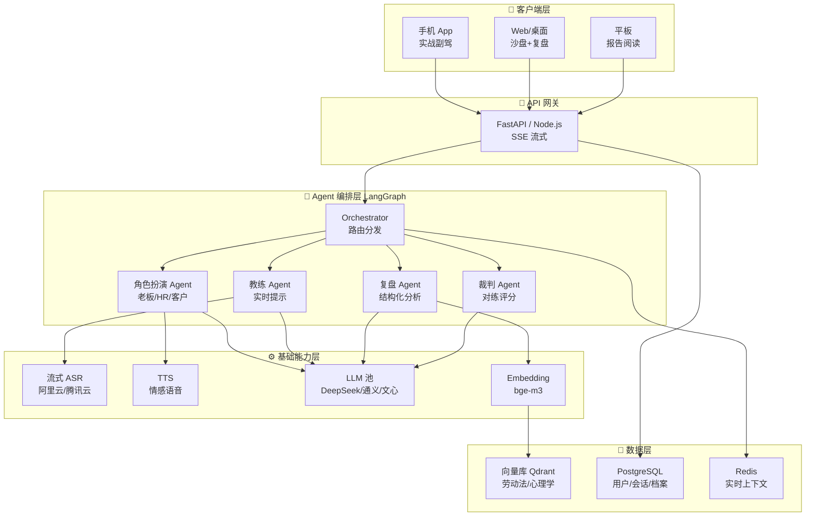
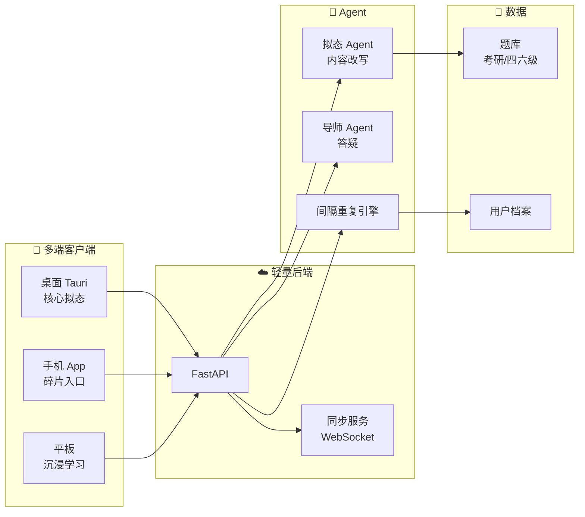

# 智能体应用创新大赛 — 主推 + 备选方案（含 PRD 与架构图）

## Context（背景与决策依据）

**比赛背景**：智能体应用创新大赛，评审看创新性、技术、应用价值、商业可行。

**用户调研**：
- 最想要：智能问答 + 即时反馈
- 高频场景：知识盲区 / 摸鱼 / 工作效率 / 聊天娱乐
- 多设备：手机 + 电脑 + 平板

**用户决策**：
- ✅ 兼顾**应用场景 + 商业价值**（不偏极端）
- ✅ **2-3 人小队**能落地（不做巨型矩阵）
- ✅ 想看**混合方案**（稳健主推 + 激进备选）
- ✅ 下一步交付：**PRD + 架构图**

---

# 🥇 主推方案：**CareerCoach AI（职场对话教练）**

## 一句话定位

> 一个让你**说不出口、想不到、谈不下来**的话，都能现场救场的 AI 职场对话教练。

整合了头脑风暴里的【AI 谈判官】+【实习生职场生存助手】。

## 1. 为什么是它（评分自检）

| 维度 | 说明 |
|------|------|
| 创新性 | "实时副驾"模式（耳机里小声提示下一句）行业稀缺；多人格沙盘对练有差异 |
| 应用场景 | 加薪谈判、拒绝加班、客户投诉、退款维权、合同沟通、面试——**用户即是高校师生**，刚需 |
| 商业价值 | C 端按次付费（5 元/场实战）或月卡 39 元；B 端企业培训客单价高 |
| 技术深度 | 多 Agent（教练/对手/裁判）、流式 ASR、RAG（劳动法/心理学）、长上下文记忆 |
| 演示效果 | 现场让评委挑场景"模拟拒绝加班"，AI 扮演老板施压，全场看屏幕 |
| 校赛安全 | 教育意义 + 校企就业合作故事 + 大学生刚需，零争议 |
| 2-3 人可行 | 核心是 LLM 应用编排，不造轮子，MVP 2 周 |

## 2. PRD（产品需求文档）

### 2.1 核心用户与痛点

| 用户 | 痛点 |
|------|------|
| 大学生实习生 | 不会写汇报邮件、不会拒绝额外活、被老板 PUA 不会怼 |
| 应届毕业生 | 谈薪资被压价、不会问福利、面试紧张 |
| 年轻打工人 | 客户难沟通、跨部门要资源被踢皮球、想离职不会谈 N+1 |
| 普通消费者 | 退款被拒、维权打不过客服话术 |

### 2.2 三大核心功能

#### 🥊 功能 1：**沙盘对练**（练习模式）
- 用户选场景（如"老板让你周末加班"）
- AI 扮演对方（**多人格池**：温和型、强硬型、PUA 型、阴阳怪气型）
- 用户语音/文字回应，AI 实时反击
- 结束后教练 AI 打分 + 给改进建议
- **演示亮点**：邀请评委现场试一把

#### 🎧 功能 2：**实时副驾**（实战模式）
- 真实场景下，手机录音 + 戴耳机
- AI 实时识别对方说话 → 0.5 秒内在耳机里小声提示下一句怎么回
- 提示分三档："保险话术"/"反击话术"/"幽默话术"用户按音量键切换
- **隐私保障**：默认本地 ASR，敏感场景不上传

#### 🔍 功能 3：**复盘师**（事后模式）
- 上传聊天截图 / 录音 / 邮件
- AI 标出"哪句你输了气场"、"哪句给了对方台阶"
- 给出"如果再来一次最佳话术"
- 形成个人沟通弱点档案，长期追踪进步

### 2.3 多端协同（命中调研痛点）

| 设备 | 角色 |
|------|------|
| 手机 | 实战副驾（核心）+ 录音上传 |
| 电脑 | 沙盘对练 + 复盘师（大屏写作） |
| 平板 | 阅读复盘报告 + 长篇练习 |

跨端会话 + 个人档案云同步。

### 2.4 商业模式

| 模式 | 说明 | 客单价 |
|------|------|--------|
| C 端订阅 | 月卡 39 / 年卡 299 | 中频 |
| C 端按次 | 实战副驾 5 元/次 | 高 ROI |
| B 端校企 | 高校就业指导处采购 | 5-50 万 |
| B 端企业 | 销售/客服培训系统 | 10-100 万 |

### 2.5 MVP 范围（2-3 人 / 4 周可交付）

**Week 1-2**：沙盘对练（最易演示，覆盖 80% 评审需求）
**Week 3**：复盘师
**Week 4**：实时副驾 Demo（只做 1 个场景，答辩时演示）

砍掉：会员系统、社区、多语言（答辩之后再做）

## 3. 架构图

## 4. 技术选型（2-3 人友好）

| 层 | 选型 | 理由 |
|----|------|------|
| 前端 | React + Tauri（桌面）/ React Native（手机） | 一套代码多端，Tauri 比 Electron 轻 |
| 后端 | FastAPI + LangGraph | Python 生态最成熟，2-3 人最易接管 |
| LLM | DeepSeek-V3（主）+ 通义千问（备） | 中文谈判语料强，价格低 |
| 语音 | 阿里云实时 ASR + Edge-TTS | 字节/阿里都有教育优惠 |
| 向量库 | Qdrant（自托管）/ 火山方舟 | 单机够用 |
| 部署 | 阿里云 ECS + OSS / 学校算力 | 演示稳定 |
| 校企资源 | **可对接电信星辰大模型 + AICloud** | 借赛事协办方资源加分 |

## 5. 风险与对策

| 风险 | 对策 |
|------|------|
| LLM 中文谈判话术不够"接地气" | 微调 DeepSeek，喂《职场厚黑学》《非暴力沟通》语料 |
| 实时副驾延迟体验差 | 流式分块 + 音量键档位选择隐藏延迟 |
| 演示翻车（网络/API） | 准备本地 fallback，关键 Demo 视频备份 |

---

# 🥈 备选方案：**FocusFlow（碎片学习助手 / 摸鱼侠包装版）**

> 当现场感觉评委偏爱"创新性"、不在意"商业模式"时切换演示。

## 1. 一句话定位

> 把考研、四六级、技能学习**伪装成 Excel/邮件/钉钉**界面，老板来了一键秒切，让大学生在自习室和工位都能"光明正大"碎片学习。

## 2. 核心创新点

- **环境拟态渲染**：学习内容自动改写成"看起来在工作"的样子
- **老板键 2.0**：全局快捷键 + 摄像头检测人靠近 + Apple Watch 心率联动
- **多端无缝**：手机看完一张卡片，回工位电脑直接接续
- **反向激励**：连续摸鱼学满 30 分钟解锁"虚拟咖啡券"

## 3. 简化 PRD

| 模块 | 功能 |
|------|------|
| 学习卡片引擎 | 60 秒微卡片 + 间隔重复（接入考研真题/四六级题库） |
| 拟态层 | LLM 把英语单词卡改写成"季度报表 Excel"等 5 套主题 |
| 老板键 | 一键切换 / 鼠标晃动检测 / 离开秒锁 |
| 多端同步 | WebSocket 长连接 + IndexedDB 离线缓存 |
| 成就系统 | 摸鱼时长 = 学习勋章 |

## 4. 架构图（精简版）

## 5. 备选 vs 主推 速对比

| 维度 | CareerCoach（主推） | FocusFlow（备选） |
|------|----------------------|-------------------|
| 创新记忆点 | ★★★★ | ★★★★★ |
| 商业模式清晰 | ★★★★★ | ★★★ |
| 演示效果 | ★★★★★（互动） | ★★★★★（视觉炸） |
| 校赛政治正确 | ★★★★★ | ★★★ ⚠️ |
| 2-3 人落地 | ★★★★ | ★★★★★ |
| 评委理解成本 | 低 | 中 |

---

# 📋 答辩演示双套脚本

## 主推 5 分钟脚本（CareerCoach）

1. **0:00-0:30 痛点切入**：放一段"老板让你周末加班，你紧张到说不出话"的真实场景视频
2. **0:30-1:30 沙盘对练 Demo**：邀请一位评委现场试，AI 扮演难缠老板
3. **1:30-2:30 实时副驾**：另一评委演练，主讲人戴耳机听 AI 提示，对话碾压
4. **2:30-3:30 复盘师**：上传一段 PUA 对话截图，AI 标重点
5. **3:30-4:30 商业故事**：高校就业指导处合作 + 企业培训
6. **4:30-5:00 技术亮点**：多 Agent 架构 + 国产 LLM + 多端

## 备选脚本（FocusFlow）

需要时切，重点演示**老板键秒切 + 跨端续学**两个 wow 时刻。

---

# ✅ 下一步执行清单

1. **确认主推方案** ← 当前
2. 细化 PRD（用户故事、API 设计、UI Wireframe）
3. 算力/账号准备（DeepSeek API、阿里云 ASR、电信资源对接）
4. Sprint 0：Tauri 壳子 + LangGraph 骨架（1 周）
5. Sprint 1：沙盘对练 MVP（1 周）
6. Sprint 2：复盘师 + 实时副驾 Demo（1 周）
7. Sprint 3：演示打磨 + 备选方案视频（1 周）

---

# 📁 关键文件参考

- 本文件（v1 总体方案）：`careercoach-vision.md`
- PRD 详细版：`careercoach-prd-v2.md`
- 设计图纸：`careercoach-design-spec.md`
- 项目地基：`careercoach-foundation.md`
